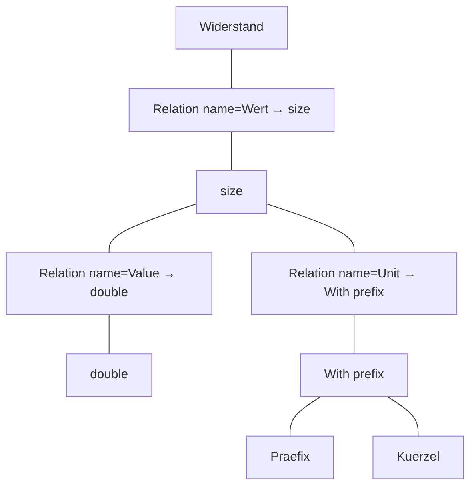

# Relation concept vs Object concept

Agreed planning model (**2026-08-09**, OQ-W1…W16). Scaffold still uses slots — migrate debt.

**Canonical developer page (diagrams kept for later user docs too):** [`docs/DEVELOPER-ATTRIBUTE-MODEL.md`](../DEVELOPER-ATTRIBUTE-MODEL.md)

## Current lean (locked)

1. **Settings** — two namespaces: **`data`** + **`view`** (OQ-W16). Live walk + hybrid overrides (OQ-W2/W3). **No** aux Attribute node / no slot term (OQ-W1).
2. **Typing** = **target of that Relation** (direct → `size`). **No `attribute_typeof`.**
3. **Relation.name** — required on **`besteht_aus` / `aggregation`** (attribute label, e.g. `Wert`). `child_of` does not need this product name.
4. **RelationType catalog (reduced):**

| Keep | Drop / park |
|------|-------------|
| `child_of` (hierarchy only) | **`composition`** — not a product type; legacy alias/migrate only → `besteht_aus` |
| `besteht_aus` | **`attribute_typeof`** — superseded (target *is* the type) |
| `aggregation` | **`ref_scope`**, **`node_embed`**, **`node_ref`**, **`node_pick`** — **deprecated** (OQ-W15); scaffold debt |
| | `has_type`, `erbt_von` — already gone |

```text
Product RelationTypes:
  child_of | besteht_aus | aggregation

Settings override deltas on:
  besteht_aus | aggregation
```

## Principle — recursive Settings & Render walk

Same job for **node** detail and **attribute** Settings (OQ-W6): walk `besteht_aus` / `aggregation` to the leaf; collect `Settings.data` + `Settings.view`; store **override deltas only** on the current Relation/node. Break cycles (OQ-W8). Write = override only — do not push defaults into subnodes (OQ-W7).

```text
Settings(attr|node) = walk to leaves ∪ Settings ∪ edge override deltas
Render(host)        = for each attr Relation: Render(target) recursively
Cycle guard         = node already on path → stop
```

## Example — Widerstand / Wert → Unit

Full diagrams: [`DEVELOPER-ATTRIBUTE-MODEL.md`](../DEVELOPER-ATTRIBUTE-MODEL.md).

| Relation | source | target | name |
|----------|--------|--------|------|
| R1 | Widerstand | size | Wert |
| R2 | size | double | Value |
| R3 | size | With prefix | Unit |
| R4 | With prefix | Praefix | Praefix |
| R5 | With prefix | text | Kuerzel |

`With prefix` = father knot, **composed of** Praefix + Kuerzel (OQ-W11); `size` inherits from `quantity` with extra settings (OQ-W10).



## Scaffold mapping (today → target)

| Concept | Scaffold today | Product target |
|---------|----------------|----------------|
| Attribute | Slot term + edge + `_wtt_type_id` | Relation only (`name` + target + deltas) |
| Type | `_wtt_type_id` | Relation target |
| Settings | typeExtras / Preferred meta | `Settings.data` + `Settings.view` |
| Instance keys | slot term id | Relation id |

## Do not

- Do not create `_wtt_attribute_slot` for new product work.
- Do not use `child_of` for attributes.
- Do not use `node_ref` / `ref_scope` / `node_embed` / `node_pick` until a use case reopens them.
