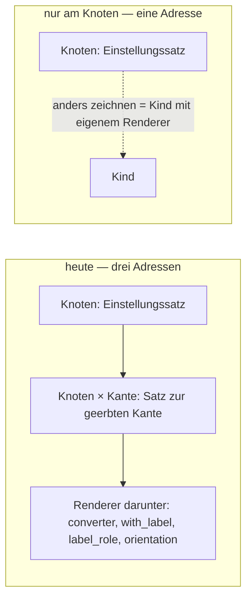
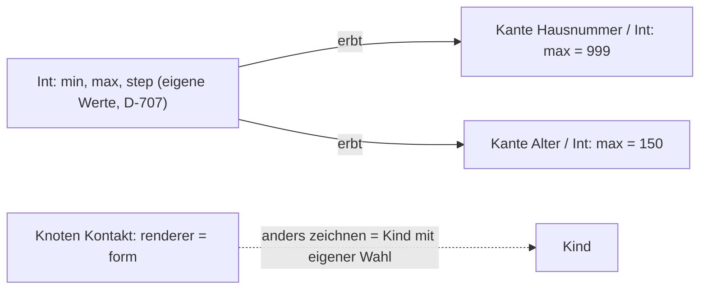
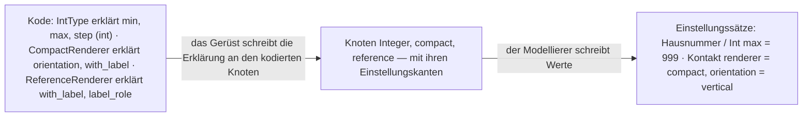
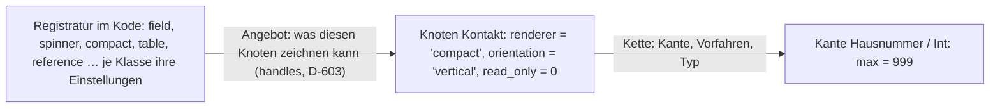

# Zielbild Einstellungen — zwei Formen nebeneinander

**2026-09-10, auf sein Wort:** *«im grunde haben wir das spiel nur gemacht um an der kante knoten
einstellungen überschreiben zu können, bin mir gerade aber garnicht sicher ob wir das brauchen … da
wir an allen knoten renderer haben, will ich einen knoten der anders gerendert ist, erstelle ich ein
kind dazu und stelle einen anderen renderer ein … habe das gefühl dass wir nicht auf einen grünen
zweig kommen.»* — und *«ja schreib die seite».*

**Diese Seite entscheidet nichts.** Sie stellt die Form von heute neben eine Form «nur am Knoten», je
Sachverhalt eine Zeile, mit dem, was gemessen ist. Was er ankreuzt, wird ein Beschluss im Buch
(`PR-3`); was offen bleibt, bleibt offen (`PR-4`).

## Die Zahlen, gemessen am 2026-09-10

| | |
|---|---|
| Knoten im Modell | **139** |
| Knoten mit eigener Renderer-Wahl | **19** — so wird heute «anders gezeichnet»: am Knoten |
| Sätze an einer Kante (`Knoten × Kante`, das Überschreiben an der Verwendungsstelle) | **3** — alle drei Reste einer Wanderung, keiner von ihm gesetzt (`read_only = 0` an `Einheitenwert × wert`, zwei Feldbreiten an `Street / H#`) |
| Werte der Renderer-Einstellungen (`with_label`, `label_role`, `orientation`, `converter`) | **6, 2, 2, 0** |
| Werte der Modell-Einstellungen (`renderer`, `read_only`) | **19, 19** |
| Zusagen im Netz, die die Renderer-Wahl und den Einstellungsbereich bewachen | **252** in `einstellungen-check`, dazu `allowed` 15, `field-order` 23 |
| Fehler der letzten zwei Tage an genau dieser Stelle | D-684, TASK-088, TASK-089, TASK-091, INF-040, INF-041 |

## Die zwei Formen

## Je Sachverhalt eine Zeile

| Sachverhalt | heute | nur am Knoten | was fällt / was es kostet |
|---|---|---|---|
| **Wo eine Einstellung wohnt** | im Einstellungssatz des Knotens ([D-704](NewConcept/90-decision-log.md)); **und** im Satz `Knoten × Kante` für eine geerbte Kante ([D-667](NewConcept/90-decision-log.md), [D-611](NewConcept/90-decision-log.md)); **und** im Satz des gewählten Renderers ([D-583](NewConcept/90-decision-log.md)) | nur im Einstellungssatz des Knotens | die Adresse `Knoten × Kante` fällt: 3 Sätze in den Schatten, der Leser `ofRelationAt`/`ofRelationsAt`, der Schreiber `putSettingAtUseSite` |
| **Wie eine Einstellung erbt** | die Kette ([D-602](NewConcept/90-decision-log.md)): Kante am Knoten, Vorfahren, Zielknoten ([D-707](NewConcept/90-decision-log.md)) | dieselbe Kette **ohne** die erste Stufe: Vorfahren, Zielknoten | eine Stufe weniger; `ModelValues::forUseSite()` liest nur noch die Kette des Ziels |
| **Wie man überschreibt** | am Knoten mit Haken ([D-687](NewConcept/90-decision-log.md)–[D-689](NewConcept/90-decision-log.md)); an der geerbten Kante im Einstellungsbereich unter der Feldzeile, mit Haken ([D-685](NewConcept/90-decision-log.md)) | nur am Knoten, mit Haken. **Ein Feld anders zeichnen heisst: ein Kind anlegen und dort wählen** — sein Weg, und der der 19 Knoten heute | der Einstellungsbereich unter der Feldzeile fällt (D-666 als Ort; «wie oft» und die Art bleiben in der Zeile), damit die zweite Sperre, der zweite Haken, `taxmod_field_setting_override` |
| **`allowed` — welche Präfixe Gramm erlaubt** ([D-697](NewConcept/90-decision-log.md)) | Liste im Satz `Gramm × Präfix` | eine Einstellungskante `allowed` an `With prefix` (dem Besitzer des Feldes `Präfix`), Wert am Knoten `Gramm`: dieselbe Liste, andere Adresse | eine Wanderung: 0 Werte heute; die Kante wandert von `Prefixes` an `With prefix`; das Angebot fragt weiter das Geschwister |
| **`position` — ein Kind ordnet geerbte Felder** ([D-698](NewConcept/90-decision-log.md)) | je Kante ein Wert im Satz `Kind × Kante` | eine Einstellung `field_order` am Knoten: die Kantennummern in Reihenfolge, ein Wert | eine Wanderung: 0 Werte heute; der Leser `FieldOrder` liest eine Liste statt vieler Sätze |
| **Renderer-Einstellungen** (`with_label`, `label_role`, `orientation`, `converter`) | Kanten am Renderer-Ast, geerbt von jedem Renderer ([INF-041](neues-konzept-eingang.md)); Werte im Satz des Knotens unter der Wahl | **Wahl A:** bleiben als Kanten, je Renderer erklärt (sein Vorschlag) · **Wahl B:** `with_label`, `label_role`, `orientation` sind Sache des Renderers im Kode; nur was zum **Wert** gehört bleibt Modell (`converter`, `validator`) | A: eine Fassung, 10 Werte wandern an die Kante des gewählten Renderers · B: 10 Werte in den Schatten, der Ast unter `Renderer` wird flach, die Zeilen unter der Wahl fallen, INF-040 und INF-041 erledigen sich zur Hälfte |
| **Das Angebot einer Einstellung mit Knotenziel** | Kinder des Ziels ([D-540](NewConcept/90-decision-log.md)); bei `converter` nach Typ; bei `validator` alle | folgt dem Typ, wo eine Registratur ihn kennt (`converter`, `validator`); leer heisst: **keine Zeile** | nimmt die Zusage «eine Wahl ohne Inhalt ist ein totes Steuerelement» zurück — das braucht sein Wort |
| **Der Renderer an einer Verwendungsstelle** | gefallen ([D-643](NewConcept/90-decision-log.md)) | bleibt gefallen | — |
| **Die Satzarten** ([D-704](NewConcept/90-decision-log.md)) | `settings`, `default`, `example`, `user` | unverändert; `settings` nur noch mit `relation_id = 0` | die Spalte `node_records.relation_id` verliert ihren zweiten Sinn; sie bleibt für den Weg zurück (`INF-071`) |
| **Wächter** | `einstellungen-check` 252, `allowed` 15, `field-order` 23 | `einstellungen-check` verliert Abschnitt 6 (Einstellungsbereich unter der Feldzeile, ~20 Zusagen) und die Zeilen unter der Wahl in Abschnitt 4 (~15); `allowed` und `field-order` messen die neue Adresse | jede gefallene Zusage mit Grund in `waechter-bestand.md` (`PR-9`) |
| **Was der Modellierer verliert** | «dieses Feld ist hier read_only, dort nicht» ohne einen Knoten anzulegen | dafür ein Kind: `Kontakt` → `Kontakt, nur lesbar`. Umständlich, sein Wort — aber **eine** Regel, die jeder prüfen kann (`PR-13`) | — |

## Die dritte Form — Wert an der Kante, Zeichnung am Knoten

**Sein Einwand, nachdem die zwei Formen standen:** *«sagen wir mal int bietet sein min max selbst und
jeder knoten der von int erbt bekommt auch diese einstellungen, aber diese sind attribute des knotens,
dann müsste ich einen knoten für jede verwendung anlegen die davon abweicht, das hört sich nach vielen
knoten an, das haben wir heute alles an der kante … wir haben das schon: eine knoten-tabelle mit
kanten-id — knoten-einstellung überschrieben durch kante. somit haben wir einstellungen zu int und
einstellungen zu kante hausnummer / int.»*

⚠️ **Und die Messung stützt ihn:** *die drei Sätze an einer Kante tragen `read_only` und
`display_size` — Einstellungen des **Werts**. Kein einziger trägt eine Zeichnung.* **Der Schnitt liegt
also nicht zwischen «Knoten» und «Kante», sondern zwischen «Wert» und «Zeichnung» — und er
entscheidet nicht, *ob* etwas eine Einstellung ist, sondern nur zwei Dinge: ob sie an der Kante
überschreibbar ist, und ob das Innenleben eines Renderers überhaupt eine Einstellung ist:**

| Einstellung | gehört zum | wohnt | überschreibbar an |
|---|---|---|---|
| `min`, `max`, `step`, `display_size`, `read_only`, `validator`, `converter`, `allowed` | **Wert** | am Typ (Zielknoten, [D-707](NewConcept/90-decision-log.md)) und in der Kette | **der Kante** (`Knoten × Kante`, [D-667](NewConcept/90-decision-log.md)) — Hausnummer und Alter sind zwei Kanten auf einen Typ |
| `renderer` | **Zeichnung** — und trotzdem eine **Einstellung des Knotens** wie jede andere: Kante an der Wurzel ([D-529](NewConcept/90-decision-log.md)), im Einstellungssatz, vererbt über die Kette, mit Sperre und Haken. *Sein Wort: «render ist auch eine einstellung am knoten, auch wenn sie für das zeichnen ist.»* | am Knoten | nur am Knoten ([D-643](NewConcept/90-decision-log.md) hat die Kante schon ausgeschlossen) — anders zeichnen heisst ein Kind |
| `with_label`, `label_role`, `orientation` | **Zeichnung**, Innenleben des Renderers | heute: Kanten am Renderer-Ast, Werte unter der Wahl | Wahl A: je Renderer erklärt, am Knoten unter der Wahl · Wahl B: Sache des Renderers im Kode, keine Einstellung |
| `position` (Anordnen geerbter Felder, [D-698](NewConcept/90-decision-log.md)) | Zeichnung des Knotens | `Knoten × Kante` heute; könnte eine Liste am Knoten sein | am Knoten |

⚠️ **Sein Wort dazu, und es ist die Regel selbst:** *«und wenn ich an der kante neue einstellungen für
einen knoten machen möchte, warum nicht? dann lege ich eine neue knoten-config an mit bezug zur kante,
und mache kante schlägt knoten.»* — *Das ist der Satz `Knoten × Kante` ([D-667](NewConcept/90-decision-log.md):
ein Satz mit `relation_id` ist die Konfiguration zur Kante) und die erste Stufe der Kette
([D-602](NewConcept/90-decision-log.md): die Kante am Knoten schlägt die Vorfahren und den Typ). **Beides
steht.** Was die Klasse erklärt (Form D), darf an der Kante überschrieben werden (Form C).* ⚠️ **Eine
Ausnahme trägt heute sein eigenes, vorsichtiges Wort:** *der Renderer an der Kante ist gefallen
([D-643](NewConcept/90-decision-log.md): «ich bin mir noch nicht sicher, ob wir an der Kante einen
Renderer brauchen, deshalb würde er da wegfallen»). Ob «warum nicht» auch ihn meint, ist eine eigene
Frage — siehe die Kreuze.*

**Was diese Form von heute unterscheidet — und nur das:** *die Renderer-Einstellungen. Alles andere
steht schon so: der Wert an der Kante überschreibbar (D-611, D-667, D-685), die Zeichnung am Knoten
(D-643). Die Fehler der letzten Tage sassen alle bei der dritten Zeile — beim Innenleben des Renderers,
das wie eine Werteinstellung behandelt wurde.* **Der grüne Zweig ist also näher, als es sich anfühlt:
Form C heisst «heute, minus die Renderer-Einstellungen als Modellkanten».**

## Die vierte Form — Einstellungen sind Attribute kodierter Knoten

**Sein Wort, der Schritt zurück:** *«die einstellungen wieder als das betrachten was sie sind:
attribute von codierten knoten, dazu gehören auch die renderer. ein int hat min max im int-format, ein
double hat min max im double-format, kann beides teil des codes; was ich reinschreibe ist der
modell-datensatz, also von 0–150 oder 1–10. das gleiche gilt für renderer: ein compact-renderer hat
horizontal/vertical, with label, nicht mehr; ein reference hat with label, label type … das sind
eigentlich alles programmierte eigenschaften.»*

**Der Satz, der alles trägt: die *Erklärung* einer Einstellung ist Kode, ihr *Wert* ist Modell.**

| Sachverhalt | Form D |
|---|---|
| **Wer eine Einstellung erklärt** | die Klasse des kodierten Knotens: `IntType` → `min`, `max`, `step` als Ganzzahl; `DecimalType` → dieselben als Dezimalzahl; `TextType` → `display_size`; `CompactRenderer` → `orientation`, `with_label`; `ReferenceRenderer` → `with_label`, `label_role`; `FormRenderer` → `with_label`; `Root` (das Modell selbst) → `renderer`, `read_only`, `validator`, `position` |
| **Wo die Erklärung im Modell steht** | das Gerüst schreibt sie als Kante an den kodierten Knoten — so, wie `RenderingScaffold` heute die Renderer-Knoten aus den Klassen anlegt ([D-613](NewConcept/90-decision-log.md)). Die Kante bleibt die Adresse des Werts ([D-529](NewConcept/90-decision-log.md), [D-667](NewConcept/90-decision-log.md)) — **erklärt wird sie aber nicht mehr von Hand.** |
| **Was der Modellierer tut** | Werte schreiben: am Knoten (`Kontakt: renderer = compact`), an der Kante (`Hausnummer / Int: max = 999`, Form C), unter der Wahl (`orientation = vertical`). **Er erklärt keine Einstellungen.** |
| **Was fällt** | die Kantenart `setting` in der Maske und der Wechsel Feld ↔ Einstellung ([D-618](NewConcept/90-decision-log.md), [D-699](NewConcept/90-decision-log.md), TASK-053, TASK-066); die von Hand angelegten Einstellungskanten (`__es_hoechstens` gibt es nur in Wächtern); die Grenzknoten `integer_min` … als **Knoten** — ihre Werte werden Vorgaben im Kode ([D-707](NewConcept/90-decision-log.md) bleibt in der Sache: die Vorgabe des Typs ist die letzte Stufe, sie steht nur nicht mehr in einem Knoten); `Renderer --converter--> …` und `Renderer --label_role--> …` als geerbte Kanten für alle (INF-041 erledigt sich) |
| **Was bleibt** | die Einstellungssätze ([D-704](NewConcept/90-decision-log.md)), die Auflösungskette ([D-602](NewConcept/90-decision-log.md)), Sperre und Haken ([D-687](NewConcept/90-decision-log.md)–[D-689](NewConcept/90-decision-log.md)), das Überschreiben an der Kante für Werteinstellungen (Form C), die Wahl des Renderers am Knoten, `allowed` und `position` |
| **Der Ast `Settings`** | nur noch kodierte Knoten: `Renderer`, `Converter`, `Validator`, `Label roles` mit ihren Blättern — Ziele der erklärten Kanten, alle aus dem Gerüst |
| **Was es kostet** | je kodierter Klasse eine Zeile «meine Einstellungen»; eine Fassung, die die vier Grenzknoten wegräumt und die Renderer-Kanten umhängt (10 Werte); die Maske verliert eine Auswahl; `field-kind`-Zusagen fallen mit Grund; **Beschlüsse, die zurückgenommen werden:** D-618 (Art umstellen), D-699 (Feld → Einstellung), und D-529 wird enger: «eine Einstellung ist eine Kante — die das Gerüst aus dem Kode erklärt» |
| **Was es bringt** | eine Wahrheit je Einstellung: der Kode weiss, was ein Typ oder Renderer hat und in welchem Format; das Modell weiss nur Werte. INF-040 und INF-041 fallen zusammen: das Angebot einer Einstellung kommt aus der Klasse, nicht aus den Kindern eines Astes; was eine Klasse nicht erklärt, gibt es nicht — auch keine leere Zeile |

### Wie weit Form D heute schon wahr ist — gemessen am 2026-09-10, auf sein *«überprüfe mal»*

| Satz aus Form D | heute | Befund |
|---|---|---|
| Der Modellierer erklärt keine Einstellungen | **wahr** | 19 Einstellungskanten im Modell, **alle 19** aus Gerüsten und Wanderungsskripten (15 Dateien), keine von Hand über die Maske. Die Kantenart `setting` in der Maske (D-618, TASK-053) hat nie eine Kante angelegt, die noch steht. |
| Die Werte sind Modell | **wahr** | Einstellungssätze (D-704), 19 Renderer-Wahlen, 19 `read_only`, 20 Exponenten, 6 `with_label`, die Kette (D-602), die Sperre (D-687–689) — alles steht und läuft. |
| Die Erklärung steht am kodierten Knoten | **8 von 19** | `min`/`max`/`step` an `Integer` (IntType), `min`/`max` an `Decimal` (DecimalType), `display_size` an `Text` (TextType), `orientation` an `compact` und `table` — richtig. **4 an `Root`** (`renderer`, `read_only`, `validator`, `position`: das Modell selbst, Form D nennt es so). **3 zu breit** (`converter`, `label_role` am Behälter `Renderer`; `with_label` an `render with label` — INF-041). **4 am Einheitengerüst** (`exponent`, `allowed` an `Prefixes`; `factor`, `offset` an `Without prefix` — kodiert durch `UnitScaffold`, also Gerüst). |
| Die Klasse erklärt ihre Einstellungen | **nicht wahr** | **Keine** Typ- oder Renderer-Klasse erklärt etwas. Das Wissen ist da, aber verstreut: `SettingKey` kennt 16 Schlüssel mit Form und Format (`min` nimmt den Typ des Trägers — Int bei Int, Dezimal bei Decimal: sein Satz ist heute schon Kode); die Renderer **lesen** ihre Schlüssel ad hoc — `CompactRenderer`: `orientation`, `with_label`; `Slider`/`Spinner`: `min`, `max`, `step`; `Field`/`Textarea`: `display_size`; `Table`: `with_label`. Die Typklassen kennen nichts. |
| Das Gerüst schreibt die Erklärung aus der Klasse | **nicht wahr** | `RenderingScaffold` schreibt die **Knoten** aus den Klassen, die Kanten kamen aus Einzelskripten. Genau der Schritt, der fehlt. |
| Die Vorgabe des Typs steht im Kode | **nicht wahr** | sie steht in vier **Knoten** (`integer_min` … `decimal_max`, D-707) mit eigenen Werten. |
| Das Angebot kommt aus der Klasse | **halb** | `converter`: ja, die Registratur sagt, welche zum Typ passen; `validator`: nein, alle; `label_role`: die Kinder des Ziels. |

**Summe:** *die Werte, die Sätze, die Kette, die Sperre und acht der neunzehn Kanten stehen schon wie
in Form D. Nicht wahr sind vier Dinge, und sie sind der Bau: (1) je Klasse eine Erklärung ihrer
Einstellungen, (2) das Gerüst schreibt die Kanten daraus — und hängt `converter`, `label_role`,
`with_label` an die Renderer, die sie nennen, (3) die vier Grenzknoten werden Vorgaben in `IntType` und
`DecimalType`, (4) die Kantenart `setting` verlässt die Maske. Der Rest ist Rücknahme im Buch.*

⚠️ **Das ist Form C plus ein Schritt:** *Form C sagt, **wo** ein Wert überschrieben werden darf; Form D
sagt, **wer** die Einstellung erklärt. Beides zusammen ist ein Modell, das ein Mensch prüfen kann
(`PR-13`): «Welche Einstellungen hat Int?» — in der Klasse nachlesen. «Was gilt an Hausnummer?» — die
Kette, an der Kante zuerst.*

## Die fünfte Form — Renderer sind Kode, keine Knoten

**Sein Wort:** *«was du glaube ich übersiehst: dass jeder knoten einen renderer hat. deswegen sagte ich:
auch wenn renderer eine eigene klasse ist, ist sie auch eine eigenschaft am knoten. und die renderer haben
wir nur in die knoten geholt, weil wir sie modellieren wollten — was anscheinend ein fehler war.»*

**Der Satz:** *`renderer` ist eine Eigenschaft jedes Knotens, wie `read_only`. Ihr Wert ist ein
**Name** aus der Registratur des Kodes — nicht ein Verweis auf einen Knoten. Renderer, Konverter und
Validatoren sind Klassen und sonst nichts; ihre Einstellungen sind Eigenschaften der Klasse (Form D), die
Werte dazu stehen im Satz des Knotens.*

### Was am Renderer-als-Knoten hängt — gemessen am 2026-09-10

| | |
|---|---|
| Knoten im Ast `Settings` | **37** — davon **23 mit Klasse** (`Renderer` 17, `Converter` 4, `Validator` 2) und **5 Rollen** unter `Label roles` ohne Klasse |
| Werte, die auf einen Knoten im Ast `Settings` verweisen | **23** — 19 Renderer-Wahlen, 2 `label_role`, 2 weitere |
| Kode-Stellen, die einen Renderer über seinen Knoten suchen | **26** in 13 Dateien (`nodeImplementing`, `byImplementations`, `namesForNodes`, `RenderingScaffold`) |
| Beschlüsse, die Renderer-Knoten voraussetzen | [D-511](NewConcept/90-decision-log.md), [D-557](NewConcept/90-decision-log.md) (Renderer, Konverter, Validatoren als Knoten im Ast `Settings`), [D-583](NewConcept/90-decision-log.md) (die Wahl legt einen Satz an), [D-585](NewConcept/90-decision-log.md) (`converter` als Kante am Knoten `Renderer`), [D-644](NewConcept/90-decision-log.md), [D-648](NewConcept/90-decision-log.md), [D-684](NewConcept/90-decision-log.md) (die Wahl ist ein Verweis auf den Knoten), der Behälter-Teil von [D-613](NewConcept/90-decision-log.md) und [D-709](NewConcept/90-decision-log.md) |
| Beschlüsse, die **bleiben** | [D-603](NewConcept/90-decision-log.md) (wofür ein Renderer taugt, sagt `handles()` im Kode — das ist Form E), [D-643](NewConcept/90-decision-log.md) (oder seine Rücknahme, Kreuz 4), [D-151](NewConcept/90-decision-log.md) (Rollen sind Knoten — sie bleiben, sie sind Modell) |

| Sachverhalt | Form E |
|---|---|
| **Was `renderer` ist** | eine Einstellung jedes Knotens, Kante an der Wurzel (D-529), Wert ein **Name** (`'compact'`) — wie vor D-583/D-684, als der Wert ein Text war |
| **Woher das Angebot kommt** | aus der Registratur: `eligibleFor(Knoten, Typ)` — heute schon so (D-603); die Knoten unter `Renderer` waren nur die Hülle darum |
| **Die Einstellungen eines Renderers** | Eigenschaften der Klasse (Form D): `CompactRenderer` nennt `orientation`, `with_label`; `ReferenceRenderer` nennt `with_label`, `label_role`. Das Gerüst schreibt sie als Kanten an die **Wurzel** (nicht an Renderer-Knoten, die es nicht mehr gibt); gezeichnet wird eine Zeile nur, wenn der gewählte Renderer den Schlüssel nennt. `label_role` zeigt weiter auf `Label roles` — die sind Modell |
| **Konverter und Validatoren** | ebenso Namen aus ihrer Registratur; das Angebot folgt dem Typ, wie beim Konverter heute |
| **Was fällt** | 23 Knoten mit Klasse und die Behälter `Renderer`, `Converter`, `Validator`; `RenderingScaffold` (Knoten aus Klassen) wird zum Gerüst der **Kanten** aus Klassen; die Teilsätze und der geliehene Teil; `converter`/`label_role`/`with_label` als geerbte Kanten; 26 Kode-Stellen, die über den Knoten gehen; die Wanderung Fassung 38 (D-673ff.); die Zeilen «die Bruecke Kennung → Klasse → Knoten» in `einstellungen-check` |
| **Was wandert** | 19 Renderer-Wahlen von Knotenverweis zu Name (ein Skript, umkehrbar im Schatten); 2 `label_role`-Werte bleiben Verweise; die 4 Grenzknoten wie in Form D |
| **Was der Modellierer verliert** | nichts, was er je benutzt hat: keine Renderer-Knoten wurden von Hand angelegt, umbenannt oder beschriftet — die `select`-Beschriftungen der Renderer (`Labels`, Rolle `select`) kämen aus dem Kode wie jeder andere Software-String (`AR-2`) |
| **Was es bringt** | ein Ast weniger (37 → 5 Knoten: die Rollen), eine Adresse weniger, kein Satz hinter der Wahl, keine Kette durch den Renderer-Ast; INF-040 und INF-041 erledigen sich ganz; **Form C, D und E sind zusammen ein Modell**: der Kode erklärt, das Modell wertet, die Kante schlägt den Knoten |

### Wie Form E gespeichert wird — eine Eigenschaft, die selbst Eigenschaften hat

**Sein Wort, der Grund von damals:** *«ein renderer hat auch wieder eigenschaften, die es zu setzen
gilt. das heisst wir haben eigenschaften am programmierten knoten, die wiederum eigenschaften haben. um
das darzustellen habe ich gedacht, die modellierung wäre am einfachsten, weil wir alle möglichkeiten hier
schon haben. bin mir jetzt auch noch nicht sicher, wie wir das umsetzen würden, geschweige denn speichern
in der db.»*

**Die Antwort: flach speichern, die Verschachtelung weiss der Kode.** *Jede Einstellung, die
irgendeine Klasse erklärt — auch die eines Renderers —, wird vom Gerüst als **eine** Kante an der
Wurzel geschrieben: `orientation`, `with_label`, `label_role`, `converter`, `validator`, neben `renderer`
und `read_only`. Zwei Renderer, die denselben Schlüssel nennen (`compact` und `table` nennen beide
`orientation`), teilen sich die Kante — an einem Knoten gilt ohnehin nur ein Renderer. Der Satz des
Knotens hält dann nebeneinander:*

| Kante (Wurzel) | Wert im Satz von `Kontakt` | wer den Schlüssel erklärt | wann die Zeile gezeichnet wird |
|---|---|---|---|
| `renderer` | `'compact'` — ein Name, Text | das Modell selbst | immer |
| `orientation` | `'vertical'` — Wahl aus den Kindern von `Orientation` (D-540) | `CompactRenderer`, `TableRenderer` | nur, wenn der gewählte Renderer den Schlüssel nennt |
| `with_label` | `1` | `CompactRenderer`, `TableRenderer`, `FormRenderer`, `ReferenceRenderer`, … | dito |
| `label_role` | Verweis auf die Rolle `symbol` — die Rollen bleiben Knoten (D-151) | `ReferenceRenderer`, `ChooserRenderer` | dito |
| `read_only` | `0` | das Modell selbst | immer |

*Das ist dieselbe Tabelle wie heute (`node_records` + `relation_records`), derselbe Satz je Knoten
(D-704), dieselbe Kette (D-602), dieselbe Kante als Adresse (D-529, D-667) und dasselbe Überschreiben an
der Kante (Form C). **Neu ist nur, was es nicht mehr gibt:** kein Satz hinter der Wahl (D-583), kein
Verweis auf einen Renderer-Knoten (D-684), kein Zwischenknoten, der sagt, wer `with_label` hat — das
sagt die Klasse. Die Verschachtelung «Renderer → seine Eigenschaften» ist keine Speicherfrage, sondern
eine Frage, **welche Zeilen der Einstellungsbereich zeichnet**: die des Modells immer, die des gewählten
Renderers darunter, eingerückt, wie heute — nur aus einer Liste im Kode statt aus einem Ast.*

**Und eine Knoten-Eigenschaft, die es mehrfach gibt — `validator`.** *Sein Wort: «den könnte auch der
knoten bekommen, aber den kann es mehrfach geben, wie wird dieser gespeichert?» — und auf den ersten
Entwurf: «nein, validator ist eine knoten-eigenschaft».* **Also genau wie `read_only` und `renderer`:**
*vom Kode-Knoten erklärt, von jedem Knoten geerbt, sein Wert im Satz des Knotens — nur dass dieser Wert
**mehrere Zeilen** hat, geordnet über `position` ([D-530](NewConcept/90-decision-log.md)):
`Kontakt · validator = 'range'`, `Kontakt · validator = 'shape'`. Kein Feld, kein Teil, keine
zweite Adresse — dieselbe Eigenschaft, zwei Zeilen. Die Spalte gibt es, die Wanderung dafür ist gelaufen.*

**Sein Beispiel für «mehrfach», und die Regel, die es braucht — `converter`.** *«sagen wir mal ein
knoten könnte mehrere converter haben: ein to-upper, einen, der sich um die reihenfolge von
kommagetrennten werten kümmert, und einen weiteren, der diese dann zu von-bis zusammenfasst (beispiel:
eingabe widerstände in parts list). to-upper wäre sicherlich an anderer stelle auch noch sinnvoll. ich
könnte ein kind von text erstellen und ihm schon diese drei converter mitgeben — somit einstellung am
knoten. ich könnte aber auch sagen, ich hänge nur to-upper dran und definiere die anderen an der kante.»*

⚠️ **Was daran neu ist — und es ist kein Speicherproblem, sondern eine Regel der Kette:** *heute gilt
für jede Eigenschaft «näher schlägt ferner» ([D-602](NewConcept/90-decision-log.md)): stünde an der
Kante ein Konverter, wäre der des Knotens weg. Sein Beispiel will für eine **mehrwertige** Eigenschaft
etwas anderes: **näher ergänzt ferner** — der Knoten gibt `to-upper`, die Kante gibt `sortieren` und
`zusammenfassen` dazu, und alle drei laufen. Und sie laufen **in einer Reihenfolge**, die zählt:
erst gross schreiben, dann sortieren, dann zusammenfassen. Das ist eine Kette von Konvertern, keine
Wahl eines Konverters — heute ist `converter` `0..1`, ein einziger Name.*

| zu entscheiden | Vorschlag (`PROPOSED`) |
|---|---|
| Ein- oder mehrwertig | `converter` wird `0..*` wie `validator`; mehrere Zeilen, geordnet über `position` (D-530) |
| Was die Kette mit mehreren Werten tut | **sammeln statt ersetzen:** die Zeilen des Typs, dann des Knotens, dann der Kante — Vorfahr vor Nachfahr, Knoten vor Kante. Die Reihenfolge im Lauf ist die Reihenfolge in der Kette, und innerhalb einer Stufe `position` |
| Ein geerbter Eintrag, den man **nicht** will | ein Haken an der geerbten Zeile («hier nicht»), wie der Haken «hier überschreibe ich» bei einwertigen — die Abwahl steht als eigene Zeile im Satz, damit die Kette sie sieht |
| Woher die Namen kommen | aus der Registratur des Kodes (Form E), gefiltert nach dem Typ (`handles()`, D-603): an einem Text werden `to-upper` und `sortieren` angeboten, an einer Zahl `roman` und `hexadecimal` |
| Wo die drei aus dem Beispiel heute stehen | **nirgends** — gemessen gibt es vier Konverter (`roman`, `hexadecimal`, `binary`, `octal`), alle Zahl ↔ Text. `to-upper`, «sortieren», «zusammenfassen» sind Klassen, die es zu schreiben gäbe — je eine Datei, keine Modellfrage |

⚠️ **Und ob ein Validator selbst wieder Eigenschaften hat — gemessen: heute nicht.** *`RangeValidator`
liest `min` und `max` aus den Einstellungen des **Knotens**, die er prüft; `ShapeValidator` das Muster
aus dem Typ. Sie haben keine eigenen Schlüssel — deshalb reicht die Namensliste.* **Sollte einer je
eigene bekommen** (ein zweiter Bereich, ein eigenes Muster je Eintrag), *ist die Antwort die, die das
Modell für zusammengesetzte Werte schon hat ([D-541](NewConcept/90-decision-log.md),
[D-577](NewConcept/90-decision-log.md)): die Wertzeile zeigt auf einen **eigenen Satz**
(`value_ref_kind = record`), und darin stehen die Schlüssel dieses einen Eintrags — je Zeile ihr Satz,
so wie ein Einheitenwert je Zeile seinen hat. Flach, solange es geht; ein Teil, sobald ein Eintrag
mehr als einen Namen braucht.*

⚠️ *Der eine Ort, an dem es heute schon genau so ist: `read_only` und `renderer` sind Kanten an der
Wurzel mit Werten im Satz des Knotens. Form E macht mit `orientation`, `with_label`, `label_role`,
`converter`, `validator` dasselbe. Es ist kein neues Muster, es ist das erste Muster, auf alle angewandt.*

⚠️ **Ehrlich zum Preis:** *das ist die grösste Rücknahme seit D-529 — neun Beschlüsse, 23 Knoten, 26
Kode-Stellen, eine Wanderung. Sie wird nicht an einem Abend gebaut, und sie wird nicht fehlerweise
gebaut: erst der Beschluss mit seinen Sätzen, dann eine Baureihe mit je einem grünen Lauf, dann fallen
die Wächterzeilen mit Grund (`PR-9`). Gemessen ist der Weg dorthin kürzer als der Weg, auf dem wir sind:
die drei Fehler von heute sassen alle in der Hülle, die fällt.*

## Was «nur am Knoten» nicht löst

- **Renderer-Einstellungen** sind eine eigene Entscheidung (Wahl A oder B oben), unabhängig davon, ob
  das Überschreiben an der Kante fällt.
- **Das Angebot nach dem Passenden** (Typ, leere Zeile) ebenso.
- **Die zwei Verweisfelder auf `Node reference`** (`Unit` an Base units, `Prefix` an Prefixes) bleiben
  leere Wähler, solange sie auf den Typknoten statt auf den Knoten mit den Kindern zeigen — das ist
  sein Aufbau, nicht das Einstellungsmodell.

## Was zu entscheiden ist — je ein Kreuz

- [ ] **Form C: Wert an der Kante, Zeichnung am Knoten.** Das Überschreiben an der Kante bleibt für
  die Einstellungen des Werts (`min`, `max`, `read_only`, `display_size`, …); der Renderer wird nur am
  Knoten gewählt, anders zeichnen heisst ein Kind. *(Sein Einwand oben; die Messung stützt ihn.)*
- [ ] **Form «nur am Knoten»** — nur, wenn er die vielen Knoten in Kauf nimmt; die Messung spricht dagegen.
- [ ] **Form E: Renderer, Konverter und Validatoren sind Kode, keine Knoten.** `renderer` ist eine
  Einstellung jedes Knotens mit einem Namen aus der Registratur; die 23 Knoten mit Klasse im Ast
  `Settings` fallen, die Rollen bleiben. *(Sein Wort: «die renderer haben wir nur in die knoten
  geholt, weil wir sie modellieren wollten — was anscheinend ein fehler war.»)*
- [ ] **Form D: die Erklärung einer Einstellung ist Kode, ihr Wert ist Modell.** Typen und Renderer
  erklären ihre Einstellungen in der Klasse, das Gerüst schreibt sie an den kodierten Knoten, der
  Modellierer schreibt nur Werte. *(Sein Schritt zurück; löst Wahl A/B, INF-040 und INF-041 in einem.)*
- [ ] Falls nicht Form D: **Renderer-Einstellungen — Wahl A** (je Renderer erklärt, bleiben Modell)
  **oder Wahl B** (Zeichnung ist Sache des Renderers; nur `converter` und `validator` bleiben Modell).
- [ ] **Ein leeres Angebot zeichnet keine Zeile**, und das Angebot folgt dem Typ, wo der Kode ihn kennt.
- [ ] **Auch der Renderer darf an der Kante überschrieben werden** — dann ist D-643 zurückgenommen.
  Oder er bleibt die eine Einstellung, die nur am Knoten gilt.
- [ ] **Mehrwertige Eigenschaften sammeln sich entlang der Kette** (Typ, Knoten, Kante — in dieser
  Reihenfolge), statt einander zu ersetzen; ein geerbter Eintrag lässt sich mit einem Haken abwählen.
  `converter` wird dafür `0..*`. *(Sein Beispiel: to-upper am Knoten, sortieren und zusammenfassen an
  der Kante — alle drei laufen.)*
- [ ] **Reihenfolge:** erst der Beschluss, dann eine Baureihe, dann bauen — nicht fehlerweise.

*Nichts auf dieser Seite ist gebaut. Gemessen ist alles.*
