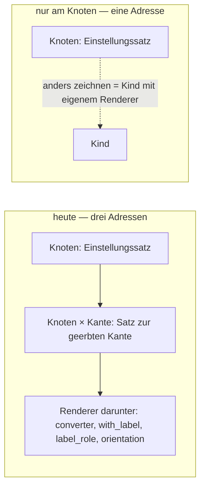

# Zielbild Einstellungen — zwei Formen nebeneinander

**2026-09-10, auf sein Wort:** *«im grunde haben wir das spiel nur gemacht um an der kante knoten
einstellungen überschreiben zu können, bin mir gerade aber garnicht sicher ob wir das brauchen … da
wir an allen knoten renderer haben, will ich einen knoten der anders gerendert ist, erstelle ich ein
kind dazu und stelle einen anderen renderer ein … habe das gefühl dass wir nicht auf einen grünen
zweig kommen.»* — und *«ja schreib die seite».*

**Diese Seite entscheidet nichts.** Sie stellt die Form von heute neben eine Form «nur am Knoten», je
Sachverhalt eine Zeile, mit dem, was gemessen ist. Was er ankreuzt, wird ein Beschluss im Buch
(`PR-3`); was offen bleibt, bleibt offen (`PR-4`).

## Die Zahlen, gemessen am 2026-09-10

| | |
|---|---|
| Knoten im Modell | **139** |
| Knoten mit eigener Renderer-Wahl | **19** — so wird heute «anders gezeichnet»: am Knoten |
| Sätze an einer Kante (`Knoten × Kante`, das Überschreiben an der Verwendungsstelle) | **3** — alle drei Reste einer Wanderung, keiner von ihm gesetzt (`read_only = 0` an `Einheitenwert × wert`, zwei Feldbreiten an `Street / H#`) |
| Werte der Renderer-Einstellungen (`with_label`, `label_role`, `orientation`, `converter`) | **6, 2, 2, 0** |
| Werte der Modell-Einstellungen (`renderer`, `read_only`) | **19, 19** |
| Zusagen im Netz, die die Renderer-Wahl und den Einstellungsbereich bewachen | **252** in `einstellungen-check`, dazu `allowed` 15, `field-order` 23 |
| Fehler der letzten zwei Tage an genau dieser Stelle | D-684, TASK-088, TASK-089, TASK-091, INF-040, INF-041 |

## Die zwei Formen

## Je Sachverhalt eine Zeile

| Sachverhalt | heute | nur am Knoten | was fällt / was es kostet |
|---|---|---|---|
| **Wo eine Einstellung wohnt** | im Einstellungssatz des Knotens ([D-704](NewConcept/90-decision-log.md)); **und** im Satz `Knoten × Kante` für eine geerbte Kante ([D-667](NewConcept/90-decision-log.md), [D-611](NewConcept/90-decision-log.md)); **und** im Satz des gewählten Renderers ([D-583](NewConcept/90-decision-log.md)) | nur im Einstellungssatz des Knotens | die Adresse `Knoten × Kante` fällt: 3 Sätze in den Schatten, der Leser `ofRelationAt`/`ofRelationsAt`, der Schreiber `putSettingAtUseSite` |
| **Wie eine Einstellung erbt** | die Kette ([D-602](NewConcept/90-decision-log.md)): Kante am Knoten, Vorfahren, Zielknoten ([D-707](NewConcept/90-decision-log.md)) | dieselbe Kette **ohne** die erste Stufe: Vorfahren, Zielknoten | eine Stufe weniger; `ModelValues::forUseSite()` liest nur noch die Kette des Ziels |
| **Wie man überschreibt** | am Knoten mit Haken ([D-687](NewConcept/90-decision-log.md)–[D-689](NewConcept/90-decision-log.md)); an der geerbten Kante im Einstellungsbereich unter der Feldzeile, mit Haken ([D-685](NewConcept/90-decision-log.md)) | nur am Knoten, mit Haken. **Ein Feld anders zeichnen heisst: ein Kind anlegen und dort wählen** — sein Weg, und der der 19 Knoten heute | der Einstellungsbereich unter der Feldzeile fällt (D-666 als Ort; «wie oft» und die Art bleiben in der Zeile), damit die zweite Sperre, der zweite Haken, `taxmod_field_setting_override` |
| **`allowed` — welche Präfixe Gramm erlaubt** ([D-697](NewConcept/90-decision-log.md)) | Liste im Satz `Gramm × Präfix` | eine Einstellungskante `allowed` an `With prefix` (dem Besitzer des Feldes `Präfix`), Wert am Knoten `Gramm`: dieselbe Liste, andere Adresse | eine Wanderung: 0 Werte heute; die Kante wandert von `Prefixes` an `With prefix`; das Angebot fragt weiter das Geschwister |
| **`position` — ein Kind ordnet geerbte Felder** ([D-698](NewConcept/90-decision-log.md)) | je Kante ein Wert im Satz `Kind × Kante` | eine Einstellung `field_order` am Knoten: die Kantennummern in Reihenfolge, ein Wert | eine Wanderung: 0 Werte heute; der Leser `FieldOrder` liest eine Liste statt vieler Sätze |
| **Renderer-Einstellungen** (`with_label`, `label_role`, `orientation`, `converter`) | Kanten am Renderer-Ast, geerbt von jedem Renderer ([INF-041](neues-konzept-eingang.md)); Werte im Satz des Knotens unter der Wahl | **Wahl A:** bleiben als Kanten, je Renderer erklärt (sein Vorschlag) · **Wahl B:** `with_label`, `label_role`, `orientation` sind Sache des Renderers im Kode; nur was zum **Wert** gehört bleibt Modell (`converter`, `validator`) | A: eine Fassung, 10 Werte wandern an die Kante des gewählten Renderers · B: 10 Werte in den Schatten, der Ast unter `Renderer` wird flach, die Zeilen unter der Wahl fallen, INF-040 und INF-041 erledigen sich zur Hälfte |
| **Das Angebot einer Einstellung mit Knotenziel** | Kinder des Ziels ([D-540](NewConcept/90-decision-log.md)); bei `converter` nach Typ; bei `validator` alle | folgt dem Typ, wo eine Registratur ihn kennt (`converter`, `validator`); leer heisst: **keine Zeile** | nimmt die Zusage «eine Wahl ohne Inhalt ist ein totes Steuerelement» zurück — das braucht sein Wort |
| **Der Renderer an einer Verwendungsstelle** | gefallen ([D-643](NewConcept/90-decision-log.md)) | bleibt gefallen | — |
| **Die Satzarten** ([D-704](NewConcept/90-decision-log.md)) | `settings`, `default`, `example`, `user` | unverändert; `settings` nur noch mit `relation_id = 0` | die Spalte `node_records.relation_id` verliert ihren zweiten Sinn; sie bleibt für den Weg zurück (`INF-071`) |
| **Wächter** | `einstellungen-check` 252, `allowed` 15, `field-order` 23 | `einstellungen-check` verliert Abschnitt 6 (Einstellungsbereich unter der Feldzeile, ~20 Zusagen) und die Zeilen unter der Wahl in Abschnitt 4 (~15); `allowed` und `field-order` messen die neue Adresse | jede gefallene Zusage mit Grund in `waechter-bestand.md` (`PR-9`) |
| **Was der Modellierer verliert** | «dieses Feld ist hier read_only, dort nicht» ohne einen Knoten anzulegen | dafür ein Kind: `Kontakt` → `Kontakt, nur lesbar`. Umständlich, sein Wort — aber **eine** Regel, die jeder prüfen kann (`PR-13`) | — |

## Was «nur am Knoten» nicht löst

- **Renderer-Einstellungen** sind eine eigene Entscheidung (Wahl A oder B oben), unabhängig davon, ob
  das Überschreiben an der Kante fällt.
- **Das Angebot nach dem Passenden** (Typ, leere Zeile) ebenso.
- **Die zwei Verweisfelder auf `Node reference`** (`Unit` an Base units, `Prefix` an Prefixes) bleiben
  leere Wähler, solange sie auf den Typknoten statt auf den Knoten mit den Kindern zeigen — das ist
  sein Aufbau, nicht das Einstellungsmodell.

## Was zu entscheiden ist — je ein Kreuz

- [ ] **Das Überschreiben an der Kante fällt.** Einstellungen wohnen nur am Knoten; anders zeichnen
  heisst ein Kind mit eigener Wahl. `allowed` und `position` ziehen an den Knoten um.
- [ ] **Renderer-Einstellungen — Wahl A** (je Renderer erklärt, bleiben Modell) **oder Wahl B**
  (Zeichnung ist Sache des Renderers; nur `converter` und `validator` bleiben Modell).
- [ ] **Ein leeres Angebot zeichnet keine Zeile**, und das Angebot folgt dem Typ, wo der Kode ihn kennt.
- [ ] **Reihenfolge:** erst der Beschluss, dann eine Baureihe, dann bauen — nicht fehlerweise.

*Nichts auf dieser Seite ist gebaut. Gemessen ist alles.*
