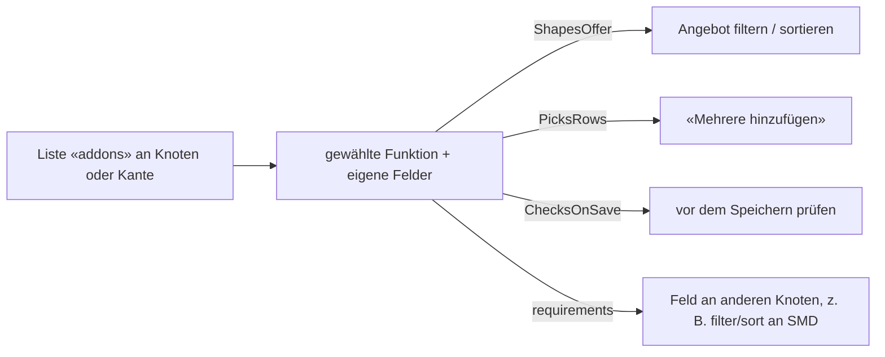

# `src/Core/Addon/` — Zusatzfunktionen: Verhalten, das man an einer Stelle anschaltet

Eine **Zusatzfunktion** ist ein benanntes Verhalten, das an einem Knoten oder einer Kante gewählt wird und eigene Felder mitbringt
([D-845](../../../docs/NewConcept/90-decision-log.md)). Sein Wort: *«relation hat zusatz funktion filter/sort. das bedingt dass …»*.
Jede erklärt selbst, **wo** sie hängen darf, **was sie an anderen Knoten bedingt** und **wo sie eingreift** — beim Anbieten, beim
Anlegen von Zeilen, beim Speichern. Die Validatoren sind die dritte Art: *«ein validator im weitergehenden sinne»*.

| Datei | Was |
|---|---|
| [`Addon.php`](Addon.php) | der Vertrag: Name, wo sie hängen darf, was sie bedingt |
| [`AddonSite.php`](AddonSite.php) | Knoten, Kante, mehrfache Kante, Kante auf Sätze |
| [`AddonRequirement.php`](AddonRequirement.php) | «das bedingt, dass …» — ein Feld am Ziel eines eigenen Feldes und darunter |
| [`ShapesOffer.php`](ShapesOffer.php), [`OfferVerdict.php`](OfferVerdict.php) | beim Anbieten: was bleibt, was nach vorn gehört |
| [`PicksRows.php`](PicksRows.php) | beim Anlegen von Zeilen: über welches Feld gewählt wird |
| [`ChecksOnSave.php`](ChecksOnSave.php) | beim Speichern: für welche Typen, und was zu beanstanden ist |
| [`Complaint.php`](Complaint.php) | eine Beanstandung — **Schlüssel und Platzhalter**, kein Satz |
| [`AddonRegistry.php`](AddonRegistry.php), [`ShippedAddons.php`](ShippedAddons.php) | wer existiert, wo sie gewählt werden dürfen, und der Satz, der mitkommt |
| [`ChosenAddon.php`](ChosenAddon.php) | eine an einer Stelle gewählte Funktion mit ihren Feldern |
| [`PresetAddon.php`](PresetAddon.php), [`PresetMode.php`](PresetMode.php) | die Vorbelegung als Vergleichspaar, filter oder sort ([D-844](../../../docs/NewConcept/90-decision-log.md)) |
| [`PickRowsAddon.php`](PickRowsAddon.php) | «Mehrere hinzufügen» ([D-806](../../../docs/NewConcept/90-decision-log.md)) |
| [`RangeValidator.php`](RangeValidator.php) | liegt der Wert in `min`/`max`? |
| [`ShapeValidator.php`](ShapeValidator.php) | hat er die Form, die sein Typ verspricht? |

Für die Prüfungen gilt die Grenze aus dem Konzept:
[R36a](../../../docs/NewConcept/30-renderer.md#r36a--the-converter-removes-what-cannot-have-been-meant-the-validator-asks-about-the-rest)
— *der Konverter entfernt, was nicht gemeint sein kann; der Validator fragt nach dem Rest.*

## Worauf dieser Ordner nicht zugreifen darf

* **Kein WordPress** (`CD-1`). Kein `__()`, kein `$wpdb`, kein `esc_*`.
* **Keine Datenbank.** Die Einstellungen kommen herein, sie werden nicht geholt
  ([D-445](../../../docs/NewConcept/90-decision-log.md)). *Deshalb gibt es hier keine
  Eindeutigkeitsprüfung: die braucht eine Abfrage und gehört an den Rand.*
* **Keine Worte.** Ein Validator gibt einen **Schlüssel** mit Platzhaltern zurück; den Satz baut der
  Rand über den Textbereich (`AR-2`,
  [R36b](../../../docs/NewConcept/30-renderer.md#r36b--a-validator-message-is-a-label-and-there-is-one-per-validator)).

## Drei Regeln für die Prüfungen, die leicht verletzt werden

1. **Mehrere je Feld** ([D-158](../../../docs/NewConcept/90-decision-log.md)). Anders als ein
   Konverter, von dem genau einer in Kraft ist. Die Registratur hört darum **nicht** beim ersten
   Treffer auf.
2. **Ein fehlender Wert ist keine Beanstandung.** Ob einer da sein muss, sagt die Multiplizität
   ([D-549](../../../docs/NewConcept/90-decision-log.md)) — an einer Stelle.
3. **Er sagt, was falsch ist, nicht was zu tun ist.** Die angebotene Korrektur ist Verhalten, und
   Verhalten ist Code ([D-036](../../../docs/NewConcept/90-decision-log.md)).

**Konzept:** [`30-renderer.md`](../../../docs/NewConcept/30-renderer.md), Abschnitte R36–R36c.
