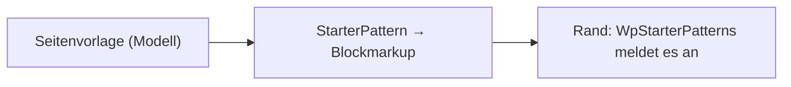

# `src/Core/Page/` — Seitenvorlagen: der Aufbau eines Beitrags aus dem Modell

Eine **Seitenvorlage** ist ein Satz im Modell: Name, Titel-Präfix, Vorspann und eine Folge von **Abschnitten** (Überschrift, Ebene,
Hilfetext, Vorgabe). Hier wird daraus das Blockmarkup eines **Startmusters**, das WordPress beim neuen Beitrag anbietet
([D-870](../../../docs/NewConcept/90-decision-log.md)).

| Datei | Was |
|---|---|
| [`StarterPattern.php`](StarterPattern.php) | Vorlage → Blockmarkup; die Feldnamen des Knotens als Vertrag |
| [`PatternSection.php`](PatternSection.php) | ein Abschnitt |

**Darf nicht abhängen von:** WordPress (`CD-1`). Das Zerlegen eines vorhandenen Beitrags in Abschnitte (`parse_blocks`) und
`register_block_pattern` gehören an den Rand.
